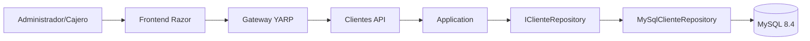

# Vista combinada C4

```mermaid
flowchart LR
    A[Administrador/Cajero] --> F[Frontend Razor]
    F --> G[Gateway YARP]
    G --> C[Clientes API]
    C --> U[Application]
    U --> R[IClienteRepository]
    R --> A2[MySqlClienteRepository]
    A2 --> DB[(MySQL 8.4)]
```
