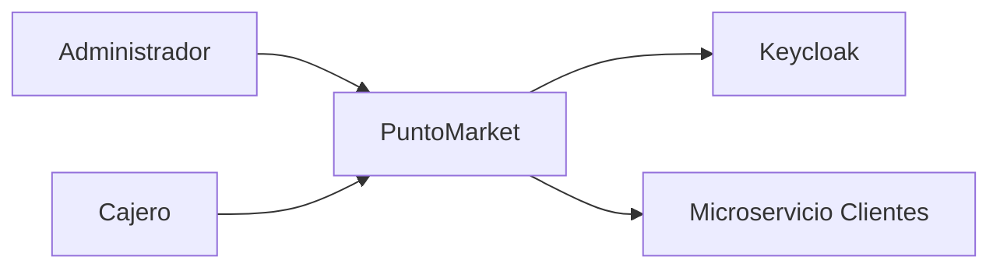

# C4 nivel 1: contexto

```mermaid
flowchart LR
    Admin[Administrador] --> PM[PuntoMarket]
    Cajero[Cajero] --> PM
    PM --> KC[Keycloak]
    PM --> Clientes[Microservicio Clientes]
```

PuntoMarket permite administrar clientes. Keycloak autentica y entrega roles `Administrador` y `Cajero`.
