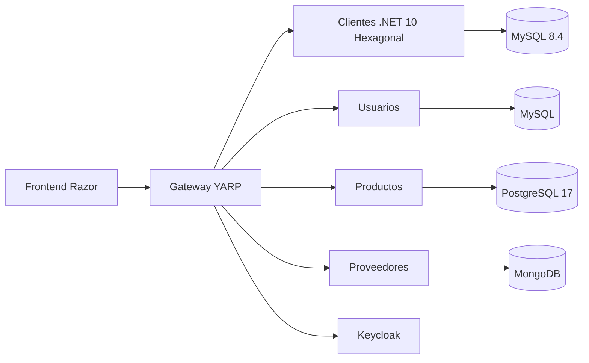

# C4 nivel 2: contenedores

```mermaid
flowchart LR
    Browser[Frontend Razor] --> Gateway[Gateway YARP]
    Gateway --> Clientes[Clientes .NET 10 Hexagonal]
    Gateway --> Usuarios[Usuarios]
    Gateway --> Productos[Productos]
    Gateway --> Proveedores[Proveedores]
    Gateway --> Keycloak[Keycloak]
    Clientes --> MySQL[(MySQL 8.4)]
    Usuarios --> MySQLU[(MySQL)]
    Productos --> PostgreSQL[(PostgreSQL 17)]
    Proveedores --> Mongo[(MongoDB)]
```
