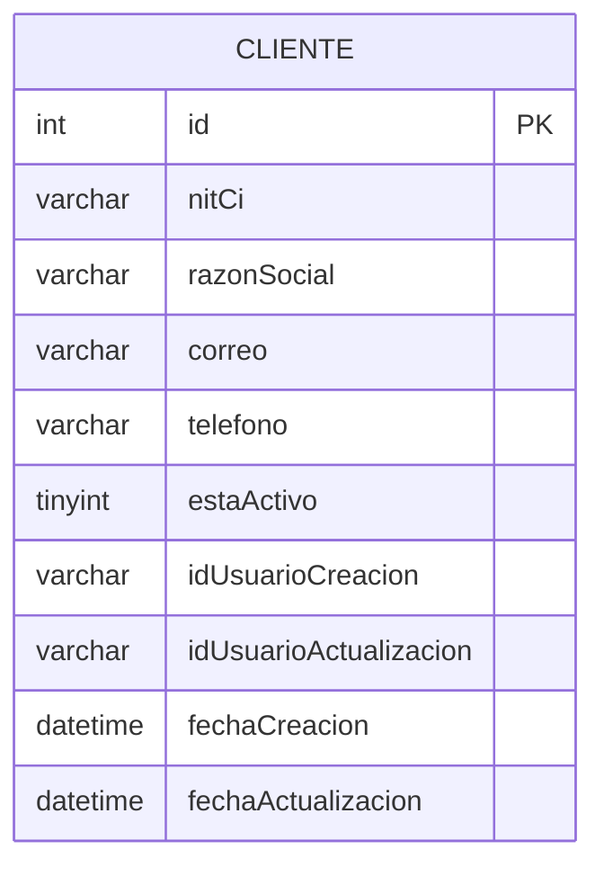

# Diagrama de base de datos

```mermaid
erDiagram
    CLIENTE {
        int id PK
        varchar nitCi
        varchar razonSocial
        varchar correo
        varchar telefono
        tinyint estaActivo
        varchar idUsuarioCreacion
        varchar idUsuarioActualizacion
        datetime fechaCreacion
        datetime fechaActualizacion
    }
```

No existen claves foráneas hacia Usuarios, Productos u otros servicios. La integración se realiza por identidad de sesión y HTTP, evitando acoplar bases.
